```bash
henil@github:~$ ./contributions.sh
```

<div align="center">
  
</div>

<br>

```bash
henil@github:~$ whoami
```

<div align="center">
  
</div>

<br>

```bash
henil@github:~$ cat ascii_identity.txt
```

<div align="center">
  
</div>

<br>

```bash
henil@github:~$ ls projects -l
```

```
01  HENEOXY  [ Major Project ]
    AI-powered Personal Computing Environment

02  COALINTEL
    Evidence-driven mining intelligence platform

03  FLUXDOCK
    Robotics / vision / control system

04  RECYCLENS
    Waste classification & recycler matching

05  PORTFOLIO
    Personal engineering portfolio & showcase
```

<br>

```bash
henil@github:~$ cat currently.txt
```

```
[role]        Computer Engineering Student
[building]    HENEOXY
[learning]    C · C++ · Web Development · Python
[exploring]   AI · GenAI · Agentic AI · RAG / LLM systems
```

<br>

```bash
henil@github:~$ ./connect.sh
```

| Terminal Link | Destination |
| :--- | :--- |
| **GitHub** | [@HenilLol](https://github.com/HenilLol) |
| **Email** | [contact@henillol.dev](mailto:contact@henillol.dev) |

<br>

---

<div align="center">
  <sub>Editorial Terminal x Minimalism x Engineering · Henil Patel</sub>
</div>
