<p align="center">
  
</p>

<p align="center">
  
</p>

<p align="center">
  
</p>

<p align="center">
  <a href="https://github.com/HenilLol/coalintel">COALINTEL</a>
  ·
  <a href="https://github.com/HenilLol/Recyclens">RECYCLENS</a>
</p>

<br>

## CURRENT STATE

```text
[role]        Computer Engineering Student
[building]    HENEOXY
[learning]    C · C++ · Web Development · Python
[exploring]   AI · GenAI · Agentic AI · RAG / LLM systems
```

<br>

## CONNECT

| Terminal Link | Destination |
| :--- | :--- |
| **GitHub** | [@HenilLol](https://github.com/HenilLol) |
| **Email** | [contact@henillol.dev](mailto:contact@henillol.dev) |

<br>

---

<div align="center">
  <sub>Editorial Terminal x Minimalism x Engineering · Henil Patel</sub>
</div>
