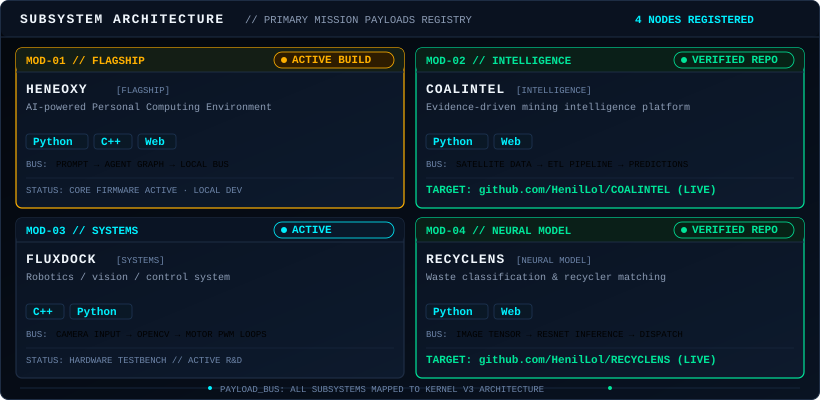

<p align="center">
  
</p>

<p align="center">
  
</p>

<p align="center">
  
</p>

<br>

## SUBSYSTEM FLIGHT PORTE

| Subsystem Node | Status | Architectural Classification | Repository Link |
| :--- | :---: | :--- | :--- |
| **HENEOXY** | `ACTIVE BUILD` | AI Personal Computing Environment | *Internal R&D* |
| **COALINTEL** | `VERIFIED` | Geospatial Mining Intelligence Platform | [▸ HenilLol/COALINTEL](https://github.com/HenilLol/COALINTEL) |
| **FLUXDOCK** | `ACTIVE` | Robotics Vision & Embedded Actuation Loops | *Hardware Testbench* |
| **RECYCLENS** | `VERIFIED` | Computer Vision Waste Classifier & Logistics | [▸ HenilLol/RECYCLENS](https://github.com/HenilLol/RECYCLENS) |

<br>

## OPERATOR EXECUTION VECTOR

```text
[OPERATOR]       Henil Patel (@HenilLol)
[DISCIPLINE]     Computer Engineering
[FOUNDATION]     C · C++ · Python · Web Engine Systems
[RESEARCH]       Agentic Architectures · Distributed RAG · Embedded Hardware Loops
[DIRECTIVE]      Architecting HENEOXY: Autonomous Personal Computing OS
```

<br>

## SUBSPACE COMM CHANNELS

| Channel | Interface |
| :--- | :--- |
| **GitHub Protocol** | [@HenilLol](https://github.com/HenilLol) |
| **Direct Transmission** | [contact@henillol.dev](mailto:contact@henillol.dev) |

<br>

---

<div align="center">
  <sub>HENEOXY KERNEL ARCHITECTURE v3.0 · DESIGNED &amp; ENGINEERED BY HENIL PATEL · AUTONOMOUS SYSTEMS &amp; COMPUTATIONAL AVIONICS</sub>
</div>
